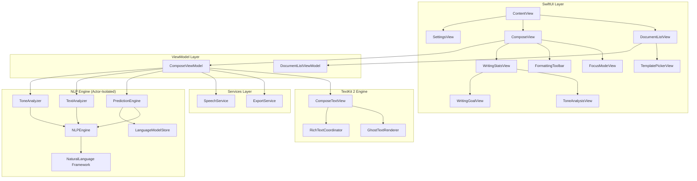

# SmartCompose ✍️


**SmartCompose** is a high-performance iOS writing assistant that delivers real-time inline text predictions using Apple's on-device NaturalLanguage framework. Featuring a TextKit 2 rich-text editor with ghost-text suggestions, async off-main-thread inference, adaptive learning from user writing patterns, and advanced analytical features — all processed locally with zero network dependency.

## ✨ Features

### 🧠 Intelligent Predictions
- **Hybrid N-Gram + Embedding Engine**: Combines frequency-based trigram/bigram models with `NLEmbedding` semantic similarity for contextually accurate predictions.
- **POS-Aware Filtering**: Uses `NLTagger` part-of-speech analysis to ensure grammatically correct suggestions (e.g., nouns after determiners).
- **Adaptive Learning**: The prediction model learns and improves from accepted suggestions, reinforcing user-specific writing patterns.
- **Multi-Word Prediction**: Generates up to 5-word predictions for more useful, sentence-completing suggestions.

### ✏️ Advanced Rich Text Editor
- **TextKit 2 Engine**: Modern `NSTextLayoutManager`-backed editor for fluid scrolling performance and high-fidelity text rendering.
- **Ghost Text Suggestions**: Translucent inline predictions rendered directly after the cursor — press **Tab** to accept, keep typing to dismiss.
- **Focus Mode**: A completely distraction-free, dark-themed fullscreen writing canvas to maximize productivity.
- **Writing Templates**: Scaffold new documents instantly with templates for Emails, Formal Letters, Meeting Notes, Essays, Reports, and Proposals.
- **Formatting Toolbar**: Bold, Italic, Heading (H1/H2/H3), and Body formatting with haptic feedback.

### 📊 Real-Time Writing Analytics & Tools
- **Tone Analysis**: Uses NLP heuristics to classify your writing tone (Formal, Semi-Formal, Informal, Academic, Creative) based on vocabulary, sentence length, and syntax markers.
- **Writing Goals**: Set target word counts (e.g., "Blog Post - 800 words") and track progress with animated UI rings.
- **Text-to-Speech Preview**: Uses `AVSpeechSynthesizer` to read your document aloud for audio-based proofreading.
- **Readability & Sentiment**: Flesch-Kincaid Reading Ease score and paragraph-level sentiment scoring.
- **Named Entity Recognition**: Automatic extraction of people, places, and organizations.
- **Seamless Exporting**: Export documents to paginated PDF, Rich Text (.rtf), or Plain Text formats directly via the native share sheet.

### ⚡ Performance Architecture
- **100% On-Device**: All NLP processing uses Apple's `NaturalLanguage` framework — no server calls, no API keys, fully offline-capable.
- **Swift Actor Isolation**: Heavy lifting is wrapped in `actor` types (`NLPEngine`, `PredictionEngine`, `ToneAnalyzer`), ensuring thread-safe concurrent access.
- **Zero Main-Thread Blocking**: All inference runs asynchronously on actor serial executors; `@MainActor` is applied only to UI-bound properties.

## 🏗️ Architecture



### 🧩 Design Patterns Used

| Pattern | Implementation |
|---|---|
| **MVVM with `@Observable`** | Clean separation of business logic in ViewModels (`ComposeViewModel`, `DocumentListViewModel`) driving UI state seamlessly on iOS 17+. |
| **Swift Actor Isolation** | Dedicated `actor` types (`NLPEngine`, `PredictionEngine`, `ToneAnalyzer`, `TextAnalyzer`) ensure highly concurrent, thread-safe background execution. |
| **Coordinator Pattern** | `RichTextCoordinator` acts as the `UITextViewDelegate`, intercepting raw UIKit events (like Tab key presses) and bridging them to SwiftUI. |
| **Debouncing** | 150ms debounce timers on text changes to prevent thrashing the NLP engine during rapid typing. |
| **Structured Concurrency** | Extensive use of `Task`, `async let`, and Task cancellation to manage parallel inference pipelines and drop stale prediction requests. |
| **UIViewRepresentable** | Bridging modern `NSTextLayoutManager` (TextKit 2) from UIKit into SwiftUI via `ComposeTextView` to access raw text layout power. |
| **Singleton** | Centralized resource management for hardware components (`HapticManager`, `SpeechService`) and heavy models (`LanguageModelStore`). |
| **State Machine** | `SuggestionState` enum safely models the discrete phases of the prediction lifecycle (idle, loading, ready, dismissed). |

## 🚀 Getting Started

### Prerequisites
- **Xcode 15.0** or later
- **iOS 17.0** or later
- **macOS 13.0** or later (for development)
- **Homebrew** & **xcodegen** (`brew install xcodegen`)

### Installation

1. **Clone the repository**
   ```bash
   git clone https://github.com/bhushanasati25/SmartCompose-On-Device-NLP-Writing-Assistant.git
   cd SmartCompose-On-Device-NLP-Writing-Assistant
   ```

2. **Generate the Xcode Project**
   ```bash
   xcodegen generate
   ```

3. **Open in Xcode & Run**
   ```bash
   open SmartCompose.xcodeproj
   ```
   - Select an iOS 17.0+ simulator (e.g., iPhone 15 Pro)
   - Press `Cmd + R` to build and run!

## 📁 Project Structure

```text
SmartCompose-On-Device-NLP-Writing-Assistant/
├── Sources/
│   └── SmartCompose/
│       ├── SmartComposeApp.swift       # @main entry point
│       ├── Models/
│       │   ├── Document.swift          # Persistence model
│       │   ├── Suggestion.swift        # Prediction result state
│       │   ├── WritingMetrics.swift    # Readability, sentiment, entities
│       │   ├── WritingTemplate.swift   # Scaffold templates
│       │   └── WritingGoal.swift       # Word count targets
│       ├── NLP/
│       │   ├── NLPEngine.swift         # NaturalLanguage framework wrapper (actor)
│       │   ├── PredictionEngine.swift  # Hybrid predictions (actor)
│       │   ├── LanguageModelStore.swift # N-gram model with learning (actor)
│       │   ├── TextAnalyzer.swift      # Async analytics (actor)
│       │   └── ToneAnalyzer.swift      # Formal/informal tone detection (actor)
│       ├── Services/
│       │   ├── ExportService.swift     # PDF/RTF/TXT generation
│       │   └── SpeechService.swift     # Text-to-speech playback
│       ├── TextEngine/
│       │   ├── ComposeTextView.swift   # UIViewRepresentable (TextKit 2)
│       │   ├── GhostTextRenderer.swift # Inline suggestion rendering
│       │   └── RichTextCoordinator.swift # UITextView delegate
│       ├── ViewModels/
│       │   ├── ComposeViewModel.swift  
│       │   └── DocumentListViewModel.swift
│       ├── Views/
│       │   ├── ContentView.swift       # Root TabView
│       │   ├── ComposeView.swift       # Full editor screen
│       │   ├── FocusModeView.swift     # Distraction-free editor
│       │   ├── TemplatePickerView.swift # Template selection
│       │   ├── DocumentListView.swift  # Document browser
│       │   ├── DocumentRowView.swift   # List row component
│       │   ├── FormattingToolbar.swift # Rich text controls
│       │   ├── WritingStatsView.swift  # Analytics dashboard
│       │   ├── ToneAnalysisView.swift  # Tone breakdown UI
│       │   ├── WritingGoalView.swift   # Progress ring UI
│       │   └── SettingsView.swift      # Preferences
│       └── Utilities/
│           ├── HapticManager.swift     
│           └── Theme.swift             
├── Tests/
│   └── SmartComposeTests/              # Unit tests for NLP & Models
├── Scripts/
│   └── build_corpus.swift              # Seed corpus generator
├── .github/workflows/ci.yml           # GitHub Actions CI
├── project.yml                         # XcodeGen configuration
└── README.md
```

## 🧪 Testing

```bash
# Generate project & run tests
xcodegen generate
xcodebuild test \
  -project SmartCompose.xcodeproj \
  -scheme SmartComposeTests \
  -destination 'platform=iOS Simulator,name=iPhone 15 Pro'
```

## 🔐 Privacy

- **100% On-Device Processing**: No text content is ever transmitted to any server.
- **Offline Capable**: Works completely without an internet connection.
- **Local Persistence**: All documents and learned patterns are stored locally on the device.

## 📱 Supported Platforms

- ✅ **iOS 17.0+**
- ✅ **iPadOS 17.0+**

## 📝 License

This project is licensed under the MIT License — see the [LICENSE](LICENSE) file for details.

## 📞 Contact

**Bhushan Asati**

Project Link: [https://github.com/bhushanasati25/SmartCompose-On-Device-NLP-Writing-Assistant](https://github.com/bhushanasati25/SmartCompose-On-Device-NLP-Writing-Assistant)